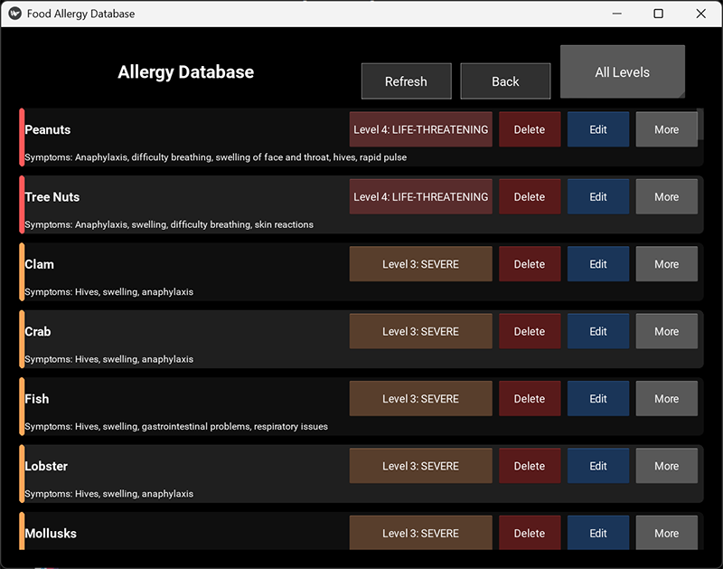

# Food Allergy Shield



A simple cross-platform application for managing food allergy information, built with Kivy.

## 🏗️ Project Structure

```
FoodAllergyShield/
├── src/                           # Source code
│   └── foodallergyshield/        # Main application package
│       ├── __init__.py           # Package initialization
│       ├── __main__.py           # CLI entry point
│       ├── app.py                # Briefcase entry point
│       ├── food_allergy_shield.py # Main application logic
│       ├── database_manager.py   # Database operations
│       └── food_allergy_shield.kv # UI layout (Kivy)
├── assets/                       # Static assets
│   ├── icon.ico                  # Application icon (Windows)
│   ├── presplash.png            # Splash screen image
│   └── img/                     # Other images
├── data/                        # Data files
│   ├── food_allergies.db        # SQLite database
│   ├── food_allergies_export.csv # Sample export
│   └── sample_data.csv          # Sample data
├── docs/                        # Documentation
├── archive/                     # Archived original files
├── build/                       # Briefcase build output
├── dist/                        # Distribution packages
├── logs/                        # Application logs
├── tools/                       # Development tools
├── run_dev.py                   # Development runner (Python)
├── run_dev.bat                  # Development runner (Windows)
├── run_dev.sh                   # Development runner (Unix/Linux)
├── pyproject.toml              # Project configuration (Briefcase)
├── requirements.txt            # Python dependencies
└── README.md                   # This file
```

## 🚀 Quick Start

### Development Mode

**Windows:**

```bash
# Double-click or run:
run_dev.bat
```

**Python (all platforms):**

```bash
python run_dev.py
```

**Unix/Linux/macOS:**

```bash
chmod +x run_dev.sh
./run_dev.sh
```

### Packaging with Briefcase

#### Automated Build (Recommended)

Use the provided build scripts that handle both building and DLL copying:

```bash
# Windows Command Prompt
scripts\build_complete.bat

# PowerShell (more detailed output)
.\scripts\build_complete.ps1
```

#### Manual Build Process

```bash
# Development testing
briefcase dev

# Create/update build
briefcase create

# Build executable
briefcase build

# Copy necessary DLLs (required for Windows)
.\scripts\post_build.ps1

# Run executable
briefcase run

# Create installer package
briefcase package
```

> **Note**: On Windows, the build scripts automatically copy necessary SDL2, GLEW, and ANGLE DLLs to fix runtime issues. See `scripts/README.md` for details.

## 📋 Requirements

- Python 3.8+
- Kivy 2.3.0+
- Briefcase (for packaging)

Install dependencies:

```bash
pip install -r requirements.txt
pip install briefcase  # For packaging
```

## 🔧 Development

### Making Changes

1. Edit files in `src/foodallergyshield/`
2. Test with `python run_dev.py` (automatically copies database from `data/`)
3. For packaging: `briefcase update && briefcase build`

### Database Management

- **Development**: Database automatically copied from `data/food_allergies.db` to `src/foodallergyshield/` when running development scripts
- **Distribution**: Database (`food_allergies.db`) is included in the MSI package
- **Data Directory**: Sample data and main database stored in `data/`

### File Structure Guidelines

- **Source Code**: All Python code goes in `src/foodallergyshield/`
- **Assets**: Images, icons in `assets/`
- **Data**: Database files, CSV data in `data/`
- **Documentation**: Markdown files in `docs/`

### Key Files

- `src/foodallergyshield/app.py` - Main application logic
- `src/foodallergyshield/database_manager.py` - Database operations
- `src/foodallergyshield/food_allergy_shield.kv` - UI layout
- `pyproject.toml` - Briefcase configuration

## 📦 Distribution

The project creates:

- **Windows**: `Food Allergy Shield-1.0.0.msi` installer
- **Executable**: `Food Allergy Shield.exe` standalone

## 🐛 Troubleshooting

### Development vs Production

- **Development**: Use `run_dev.py` for quick testing
- **Production**: Use `scripts\build_complete.bat` or `briefcase build` + `scripts\post_build.ps1`

### Common Windows Packaging Issues

- **"DLL load failed" errors**: Use the build scripts in `scripts/` folder - they automatically copy required DLLs
- **"'NoneType' object has no attribute 'size'"**: Fixed in current version with proper error handling
- **Application won't start**: Run `scripts\build_complete.ps1` for detailed build process and error checking

### Build Scripts

The `scripts/` directory contains automated build tools:
- `build_complete.bat/.ps1` - Complete build with DLL copying
- `post_build.bat/.ps1/.sh` - DLL copying only (after manual build)
- See `scripts/README.md` for detailed usage instructions

## 📄 License

MIT License - see LICENSE file for details.